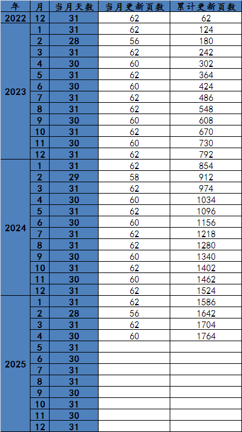

# 《现代汉语词典》（第7版）

拟在“华宇拼音输入法论坛”网友wangyanhan制作的[《现代汉语词典》第5版全文TXT](http://bbs.unispim.com/forum.php?mod=viewthread&tid=31657)基础上更新到《现代汉语词典》第7版。

原始文本SHA1信息：
```
7cd6337f27b0617d9519dfbcb0a6154661fde94b *现代汉语词典（第五版）全文_更新.txt
```

## 更新计划
* 1.逐字、词校订字词头，增加第7版新增字词头（大约4000多条）
* 2.逐字、词修订原第5版中的私用区PUA标识▲（大约1000多行）
* 3.逐字、词增加第7版新增字词头的注音和释义（大约4000多条）
* 4.逐字、词修订第7版修改的释义（大约1100多条）
* 5.2022.12.1起，每日2页，逐页更新。



## 更新进度
|拼音头|页码范围|页数|1.字词头修订|2.PUA修订|3.释义增加|4.释义修订|
|------|------|------|------|------|------|------|
|a|1~15|15|√|√|√|√|
|b|16~116|101|√|√|x|x|
|c|117~229|113|√|x|x|x|
|d|230~338|109|√|x|x|x|
|e|339~348|10|√|x|x|x|
|f|349~414|66|√|x|x|x|
|g|415~504|90|√|x|x|x|
|h|505~597|93|√|x|x|x|
|j|598~719|122|√|x|x|x|
|k|720~767|48|√|x|x|x|
|l|768~864|97|√|x|x|x|
|m|865~930|66|√|x|x|x|
|n|931~966|36|√|x|x|x|
|o|967~969|3|√|x|x|x|
|p|970~1019|50|√|x|x|x|
|q|1020~1089|70|√|x|x|x|
|r|1090~1118|29|√|x|x|x|
|s|1119~1258|140|√|x|x|x|
|t|1259~1339|81|√|x|x|x|
|w|1340~1395|56|√|x|x|x|
|x|1396~1496|101|√|x|x|x|
|y|1497~1625|129|√|x|x|x|
|z|1626~1760|135|√|x|x|x|

## 《现代汉语词典》（第7版）APP
《现代汉语词典》（第7版）APP已于2019年8月22日由商务印书馆正式发布，可以免费[下载](http://shangdi.haidii.com/d/21004/)，亦可付费内购高级功能。

## 《现代汉语词典》（第5~7版）PDF下载
```
ed2k://|file|《现代汉语词典》（第5版）.pdf|113200591|44209A97744FABCEC7261A0C2197E511|/
ed2k://|file|《现代汉语词典》（第6版）.pdf|136273636|AC6AF9D83010BD9124F71A2BACC4316D|/
ed2k://|file|《现代汉语词典》（第7版）.pdf|114211895|5B6B2F83937E624D1D95AAF6F2701D23|/
```
